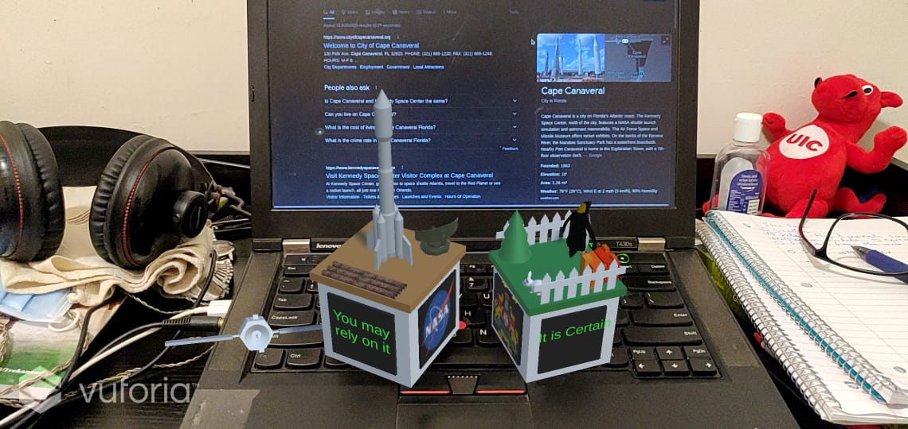

# cs428-project-1
The first class project on building augmented reality knickknacks.

1. The Merge Cube Knickknack is for Cape Canaveral, Florida

2. The Class Cube Knickknack is for Mysore, a city in India. Where there is a large zoo.

## Merge Cube

1. Making both cubes work

2. Implementing the magic eight ball.
Checking if object is flipped. 

Nasa Emblem: https://en.wikipedia.org/wiki/File:NASA_logo.svg

Sounds Used in the NASA knickknack:

1. Mission Crontrol Ambient Music by user ProtoSounds https://freesound.org/people/ProtoSounds/sounds/379269/

2. Apollo and Mercury Sounds & Sound Bites by user DudeAwesome https://freesound.org/people/DudeAwesome/sounds/386070/

3. WINK-01.wav by user newagesoup https://freesound.org/people/newagesoup/sounds/350359/ (Used for the sound that the magic-eight-ball makes when updating text)

Online Models Used:

1. Sputnik 1 by Ludashov Anton https://assetstore.unity.com/packages/3d/vehicles/space/3d-model-sputnik-1-192475

2. Pipers by Maksim Bugrimov https://assetstore.unity.com/packages/3d/environments/industrial/pipers-63800

3. Military radar by Yorzh Aleksey https://assetstore.unity.com/packages/3d/environments/military-radar-93579

My Models:

1. Rocket

2. Sattelite

## Class Cube

Ambient Sound:
Jungle by user spiid https://freesound.org/people/spiid/sounds/344204/ 

Karnataka State Emblem: https://upload.wikimedia.org/wikipedia/commons/thumb/a/aa/Seal_of_Karnataka.svg/278px-Seal_of_Karnataka.svg.png

Online Models used:

1. Voxel Animals Pack by Total Game Assets https://assetstore.unity.com/packages/3d/characters/animals/voxel-animals-pack-133366

2. White Rabbit by Niwashi Games https://assetstore.unity.com/packages/3d/characters/animals/white-rabbit-138709

3. Imperial Penguin by user Felis Chaus https://assetstore.unity.com/packages/3d/characters/animals/birds/imperial-penguin-100397

My Own Models:

1. Tree

2. Fences

